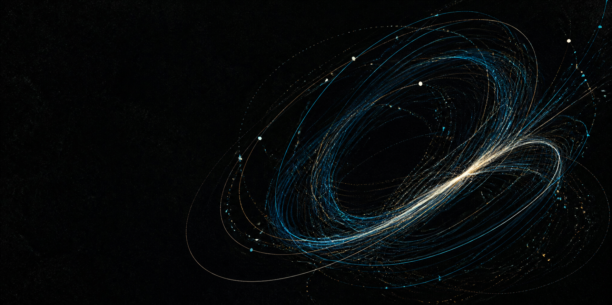

# Formarium

### A living archive of visual experiments.

Mathematical forms, ASCII studies, particle systems, shaders, and whatever comes next — collected in one quietly playful, interactive library.

[Explore the catalog](#the-catalog)

## What is Formarium?

Formarium is a library-first home for computational art. Browse by art form, open a work, and spend a little time with the system behind it. Each experiment is a self-contained React boundary, so the library can hold very different kinds of runtimes without flattening them into one visual language.

The catalog is data-driven: new collections and experiments can be added without redesigning the application.

## The catalog

| Collection | What to expect |
| --- | --- |
| **Mathematical Art** | Parametric curves, attractors, fields, and trigonometric studies |
| **ASCII Art** | Glyphs, typographic landscapes, and low-resolution visual systems |
| **Particle Art** | Flocks, fields, swarms, and emergent motion |
| **Abstract Art** | Shader-like compositions, light, texture, and atmosphere |

## Designed for experimentation

- **Library first** — browse collections and works before committing to a runtime.
- **Lazy by default** — full artwork modules load only when an experiment is opened.
- **Preview-aware** — cards use lightweight preview renderers and mount them near the viewport.
- **Runtime-agnostic** — Canvas, WebGL, WebGPU, p5.js, Three.js, shaders, ASCII, or plain React can live behind the same boundary.
- **Small, legible architecture** — metadata, registries, routes, and renderers have clear jobs.

## Spend some time with the work

Open a piece, watch it move, and follow the small rules that make it behave. Some works are delicate and mathematical; others are noisy, strange, or almost meditative. The point is to leave room for each experiment to become itself.

❤️ Made for curious systems, beautiful accidents, and the next experiment.

